# ACSC Windows Hardening - Azure Machine Configuration

This project implements the Australian Cyber Security Centre (ACSC) Windows hardening guidelines for Windows 10 and Windows 11 workstations using Azure Machine Configuration (formerly Azure Policy Guest Configuration).

## Overview

Azure Machine Configuration provides native capability to audit or configure operating system settings as code for machines running in Azure and hybrid Arc-enabled machines. This repository contains PowerShell DSC configurations that implement the ACSC Windows hardening recommendations.

## ACSC Guidelines Implemented

This project implements security configurations based on the [ACSC Hardening Microsoft Windows 10 and Windows 11 workstations](https://www.cyber.gov.au/resources-business-and-government/maintaining-devices-and-systems/system-hardening-and-administration/system-hardening/hardening-microsoft-windows-10-and-windows-11-workstations) publication.

### High Priority Configurations
- ✅ Application hardening
- ✅ Operating system patching
- ✅ Application control
- ✅ Attack surface reduction (ASR)
- ✅ Credential protection (Credential Guard, WDigest)
- ✅ Controlled Folder Access
- ✅ Credential entry (Secure Desktop)
- ✅ Early Launch Antimalware (ELAM)
- ✅ User Account Control (UAC)
- ✅ Exploit protection
- ✅ Local administrator accounts (LAPS)
- ✅ Microsoft Edge hardening
- ✅ Multi-factor authentication (Windows Hello for Business)
- ✅ Operating system architecture (x64)
- ✅ Restricting privileged accounts
- ✅ Secure Boot

### Medium Priority Configurations
- ✅ Account lockout policy
- ✅ Anonymous connections
- ✅ Antivirus software (Microsoft Defender)
- ✅ Audit event management
- ✅ Autoplay and AutoRun
- ✅ Drive encryption (BitLocker)
- ✅ Endpoint device control
- ✅ Network authentication
- ✅ Password policy
- ✅ PowerShell security
- ✅ Remote Desktop Services
- ✅ Windows Firewall

## Project Structure

```
├── .github/
│   └── workflows/
│       └── release.yml         # GitHub Actions automated build workflow
├── configurations/              # PowerShell DSC configurations
│   ├── high-priority/          # High priority ACSC recommendations
│   │   └── ACSCHighPriorityHardening.ps1
│   └── medium-priority/        # Medium priority ACSC recommendations
│       └── ACSCMediumPriorityHardening.ps1
├── packages/                   # Machine Configuration packages (generated)
├── policies/                   # Azure Policy definitions (JSON)
│   ├── acsc-high-priority-policy.json
│   └── acsc-medium-priority-policy.json
├── scripts/                    # Deployment and utility scripts
│   ├── Deploy-ACSCToAzure.ps1
│   └── New-ACSCMachineConfigurationPackage.ps1
├── terraform/                  # Terraform deployment modules
│   ├── azure/                  # Azure-specific module
│   │   ├── main.tf             # Main Terraform configuration
│   │   ├── variables.tf        # Input variables
│   │   ├── outputs.tf          # Output values
│   │   ├── policy.tf           # Policy definitions and assignments
│   │   ├── terraform.tfvars.example # Example configuration
│   │   └── README.md           # Azure module documentation
│   ├── aws/                    # AWS-specific module (coming soon)
│   │   └── README.md           # AWS module documentation
│   └── README.md               # Terraform modules overview
├── build-release.ps1           # Automated build script
└── docs/                       # Documentation
```

## Prerequisites

### For Development/Building Packages
- PowerShell 5.1 (Windows PowerShell) or PowerShell Core 7.x
- PowerShell modules (installed automatically by scripts):
  - GuestConfiguration
  - Az.Accounts, Az.Resources, Az.Storage
  - SecurityPolicyDsc, AuditPolicyDsc, PSDscResources
- **Windows Security Baseline** - **Installed automatically via Chocolatey**
  - The DSC configurations automatically install Chocolatey and the `winsecuritybaseline` package
  - Provides essential Group Policy templates (MSS-legacy.admx, MSSecurityGuide.admx)
  - Manual download available: [Microsoft Security Compliance Toolkit](https://www.microsoft.com/download/details.aspx?id=55319)

### For Azure Deployment
- Azure subscription with Azure Policy and Machine Configuration enabled
- Appropriate RBAC permissions:
  - Policy Contributor (to create policy definitions)
  - Contributor or Owner (to create policy assignments and role assignments)
- Target Windows machines:
  - Windows 10 (versions supported by Microsoft)
  - Windows 11 (all versions)
  - Windows Server 2016, 2019, 2022
  - Azure VM or Arc-enabled machine
  - Managed identity enabled
  - Guest Configuration extension installed

## Deployment Process Flow

```mermaid
flowchart TD
    Start([Start Deployment]) --> Method{Choose<br/>Build Method}
    
    Method -->|GitHub Actions| GitHubBuild
    Method -->|Local Build| LocalBuild
    
    GitHubBuild[Create Git Tag<br/>git tag v1.0.0<br/>git push origin v1.0.0]
    GitHubBuild --> GitHubAction[GitHub Actions Workflow Triggered<br/>windows-latest runner]
    
    GitHubAction --> InstallModules[Install PowerShell Modules<br/>- GuestConfiguration<br/>- SecurityPolicyDsc<br/>- AuditPolicyDsc<br/>- PSDscResources]
    
    InstallModules --> CompileHigh[Compile High Priority DSC<br/>Windows PowerShell 5.1]
    CompileHigh --> CompileMed[Compile Medium Priority DSC<br/>Windows PowerShell 5.1]
    
    CompileMed --> CreatePackages[Create Machine Configuration Packages<br/>- ACSCHighPriorityHardening.zip<br/>- ACSCMediumPriorityHardening.zip]
    
    CreatePackages --> GenerateHashes[Generate SHA256 Hashes<br/>- High.zip.sha256<br/>- Medium.zip.sha256]
    
    GenerateHashes --> CreateRelease[Create GitHub Release<br/>Attach all artifacts]
    CreateRelease --> DownloadRelease[Download Release Artifacts]
    DownloadRelease --> DeployToAzure
    
    LocalBuild[Run build-release.ps1<br/>-Version '1.0.0']
    LocalBuild --> LocalCheck{PowerShell<br/>7.x detected?}
    LocalCheck -->|Yes| LaunchPS5[Auto-launch Windows PowerShell 5.1<br/>for DSC compilation]
    LocalCheck -->|No| LocalCompile
    LaunchPS5 --> LocalCompile
    
    LocalCompile[Compile DSC Configurations<br/>Check for module conflicts]
    LocalCompile --> LocalPackage[Create Packages<br/>./release directory]
    LocalPackage --> LocalHash[Generate Hashes<br/>and Manifest]
    LocalHash --> DeployToAzure
    
    DeployToAzure[Run Deploy-ACSCToAzure.ps1<br/>-SubscriptionId -ResourceGroupName]
    DeployToAzure --> ConnectAzure[Connect to Azure<br/>Interactive or Service Principal]
    
    ConnectAzure --> CreateStorage{Storage account<br/>exists?}
    CreateStorage -->|No| NewStorage[Create storage account<br/>+ private container]
    CreateStorage -->|Yes| UploadPackages
    NewStorage --> UploadPackages
    
    UploadPackages[Upload packages to blob storage<br/>Generate SAS tokens]
    UploadPackages --> PolicyCheck{Policy definitions<br/>exist?}
    
    PolicyCheck -->|Yes| CleanupOld[Delete old assignments<br/>Delete old definitions<br/>Wait for propagation]
    CleanupOld --> CreatePolicy
    PolicyCheck -->|No| CreatePolicy
    
    CreatePolicy[Create policy definitions<br/>Mode: Microsoft.GuestConfiguration<br/>assignmentType: ApplyAndAutoCorrect]
    CreatePolicy --> CreateAssignment[Create policy assignments<br/>System-assigned managed identity]
    
    CreateAssignment --> WaitIdentity{Managed identity<br/>propagated?}
    WaitIdentity -->|Retry| Wait[Wait 10 seconds<br/>Attempt 1-6]
    Wait --> WaitIdentity
    WaitIdentity -->|Failed| IDError[❌ Identity creation failed]
    WaitIdentity -->|Success| AssignRole
    
    AssignRole[Assign Contributor role<br/>to managed identity]
    AssignRole --> PolicyDeployed([✅ Policy Deployed])
    
    PolicyDeployed --> VMEval[Azure Policy evaluates VMs<br/>20-30 minutes initial scan]
    VMEval --> VMCheck{VM has Guest<br/>Configuration?}
    
    VMCheck -->|No| AutoInstall[Policy auto-installs:<br/>1. Managed identity<br/>2. GuestConfiguration extension]
    VMCheck -->|Yes| ApplyConfig
    AutoInstall --> ApplyConfig
    
    ApplyConfig[Apply DSC Configuration<br/>1. Install Chocolatey<br/>2. Install WinSecurityBaseline<br/>3. Apply hardening settings]
    
    ApplyConfig --> InitialCompliance[Initial Compliance Check<br/>Report to Azure Policy]
    InitialCompliance --> DriftMonitor[🔄 Continuous Monitoring<br/>Check every 15 minutes]
    
    DriftMonitor --> DriftCheck{Drift<br/>detected?}
    DriftCheck -->|No| ReportStatus[Report compliance status<br/>Every 24 hours]
    DriftCheck -->|Yes| AutoCorrect[Auto-correct configuration<br/>ApplyAndAutoCorrect mode]
    AutoCorrect --> ReportStatus
    ReportStatus --> DriftMonitor
    
    style Start fill:#e1f5ff
    style GitHubBuild fill:#e8f4f8
    style LocalBuild fill:#e8f4f8
    style CreateRelease fill:#e1ffe1
    style PolicyDeployed fill:#e1ffe1
    style DriftMonitor fill:#fff4e1
    style AutoCorrect fill:#ffe8cc
    style IDError fill:#ffe1e1
```



## Quick Start

### Option 1: Terraform Deployment (Recommended)

The easiest way to deploy is using the Terraform module, which automates the entire process:

**Azure Deployment:**
```bash
cd terraform/azure
cp terraform.tfvars.example terraform.tfvars
# Edit terraform.tfvars with your Azure subscription details

terraform init
terraform plan
terraform apply
```

**AWS Deployment:**
```bash
cd terraform/aws
cp terraform.tfvars.example terraform.tfvars
# Edit terraform.tfvars with your AWS configuration

terraform init
terraform plan
terraform apply

# Tag EC2 instances to receive hardening
aws ec2 create-tags --resources i-INSTANCE-ID --tags Key=ACSC-Hardening,Value=Enabled
```

See [terraform/README.md](terraform/README.md) for detailed documentation on both modules.

The Terraform modules automatically:
- Download packages from GitHub releases
- Create storage (Azure Storage Account / S3 Bucket) and upload packages
- Generate secure access tokens/permissions
- Create and configure policies/associations
- Set up managed identities and roles

See [terraform/README.md](terraform/README.md) for detailed documentation.

### Option 2: PowerShell Deployment with GitHub Release

Deploy using the PowerShell script with automatic GitHub release download:

```powershell
.\scripts\Deploy-ACSCToAzure.ps1 `
    -SubscriptionId "your-subscription-id" `
    -ResourceGroupName "your-resource-group" `
    -StorageAccountName "yourstorageaccount" `
    -UseGitHubRelease
```

### Option 3: Local Build and Deploy

1. **Build packages locally**
   ```bash
   # Tag a release version
   git tag v1.0.0
   git push origin v1.0.0
   
   # Or build locally
   .\build-release.ps1 -Version "1.0.0"
   ```

2. **Deploy to Azure**
   ```powershell
   .\scripts\Deploy-ACSCToAzure.ps1 `
       -SubscriptionId "your-subscription-id" `
       -ResourceGroupName "your-resource-group" `
       -StorageAccountName "yourstorageaccount"
   ```

3. **Monitor compliance** in Azure Policy dashboard (20-30 minutes for initial evaluation)

### Option 4: Manual Setup

1. **Install required modules**
   ```powershell
   Install-Module -Name GuestConfiguration, Az.Accounts, Az.Resources, Az.Storage -Force
   Install-Module -Name SecurityPolicyDsc, AuditPolicyDsc, PSDscResources, cChoco, xPSDesiredStateConfiguration -Force
   ```

2. **Create packages**
   ```powershell
   .\scripts\New-ACSCMachineConfigurationPackage.ps1 -ConfigurationLevel All
   ```

3. **Deploy manually** using Azure Portal or Azure CLI

## Enforcement Modes

Azure Machine Configuration supports two enforcement modes via the `assignmentType` parameter:

- **ApplyAndMonitor**: Configuration is applied once and monitored for drift (manual remediation required)
- **ApplyAndAutoCorrect**: Configuration is applied and automatically corrected every 15 minutes on drift (recommended)

Both configurations in this repository are set to **ApplyAndAutoCorrect** mode for automatic drift remediation.

### How Auto-Correction Works

1. Initial application: Configuration is applied when policy is first assigned
2. Continuous monitoring: Azure Guest Configuration agent checks compliance every 15 minutes
3. Automatic remediation: If drift is detected, the configuration is automatically reapplied
4. Compliance reporting: Status is reported to Azure Policy dashboard every 24 hours

Example: If a user disables Credential Guard, it will be automatically re-enabled within 15 minutes.

## Compliance Reporting

Machine Configuration provides detailed compliance reporting through:
- Azure Policy compliance dashboard
- Azure Resource Graph queries
- Guest assignment reports
- Per-setting compliance details

## Security Benefits

Implementing these configurations provides:
- Enhanced protection against malware and exploits
- Reduced attack surface
- Improved credential security
- Better audit capabilities
- Compliance with Australian government security guidelines

## Documentation

- [Implementation Guide](docs/implementation-guide.md) - Step-by-step deployment instructions
- [Configuration Reference](docs/configuration-reference.md) - Detailed setting explanations
- [Native Windows Support](docs/native-windows-support.md) - Windows SKU and hardware requirements
- [Microsoft Security Baselines Comparison](docs/microsoft-security-baselines-comparison.md) - How this relates to Microsoft baselines
- [Windows Security Baseline Installation](docs/windows-security-baseline-installation.md) - **Required dependency installation**

## Contributing

Contributions are welcome! Please:
1. Fork the repository
2. Create a feature branch
3. Submit a pull request with detailed description
4. Ensure all configurations are tested

## License

This project is licensed under the MIT License - see the LICENSE file for details.

## References

- [ACSC Windows Hardening Guidelines](https://www.cyber.gov.au/resources-business-and-government/maintaining-devices-and-systems/system-hardening-and-administration/system-hardening/hardening-microsoft-windows-10-and-windows-11-workstations)
- [Azure Machine Configuration Overview](https://learn.microsoft.com/en-us/azure/governance/machine-configuration/overview)
- [Microsoft Security Baselines](https://techcommunity.microsoft.com/t5/microsoft-security-baselines/bg-p/Microsoft-Security-Baselines)
- [Microsoft Security Compliance Toolkit](https://www.microsoft.com/download/details.aspx?id=55319)

## Known Issues

### GuestConfiguration Module Temp Directory Permission Error

**Symptoms:**
- Error: `Remove-Item: Access to the path 'C:\Users\...\PowerShell\Modules\GuestConfiguration\4.11.0\gcworker\temp' is denied`
- Multiple `Copy-Item: Could not find a part of the path` errors
- Package creation fails with `CreateFromDirectory` error

**Cause:**
The GuestConfiguration module's internal temp directory has file locks or permission issues preventing cleanup. This typically occurs when:
- Previous package creation was interrupted
- PowerShell processes have file handles on the temp directory
- Insufficient permissions to modify the module directory

**Solutions:**

1. **Run as Administrator** (Recommended)
   ```powershell
   # Close all PowerShell windows
   # Open PowerShell as Administrator
   # Run package creation script again
   ```

2. **Manual cleanup**
   ```powershell
   # Find the temp directory
   $module = Get-Module -Name GuestConfiguration -ListAvailable | Sort-Object Version -Descending | Select-Object -First 1
   $tempPath = Join-Path $module.ModuleBase "gcworker\temp"
   
   # Remove it
   Remove-Item -Path $tempPath -Recurse -Force
   
   # Recreate it
   New-Item -Path $tempPath -ItemType Directory -Force
   ```

3. **Reboot**
   - Restart the machine to clear all file locks
   - Run package creation script again

4. **Alternative: Use build-release.ps1**
   ```powershell
   # The automated build script handles these errors more gracefully
   .\build-release.ps1 -Version "1.0.0"
   ```

**Prevention:**
- Always run package creation scripts as Administrator
- Close all PowerShell windows before creating packages
- Use the automated build scripts which include better error handling

## Support

For issues related to this implementation, please create an issue in this repository.
For ACSC guidelines questions, contact the Australian Cyber Security Centre.
For Azure Machine Configuration support, contact Microsoft Azure support.
